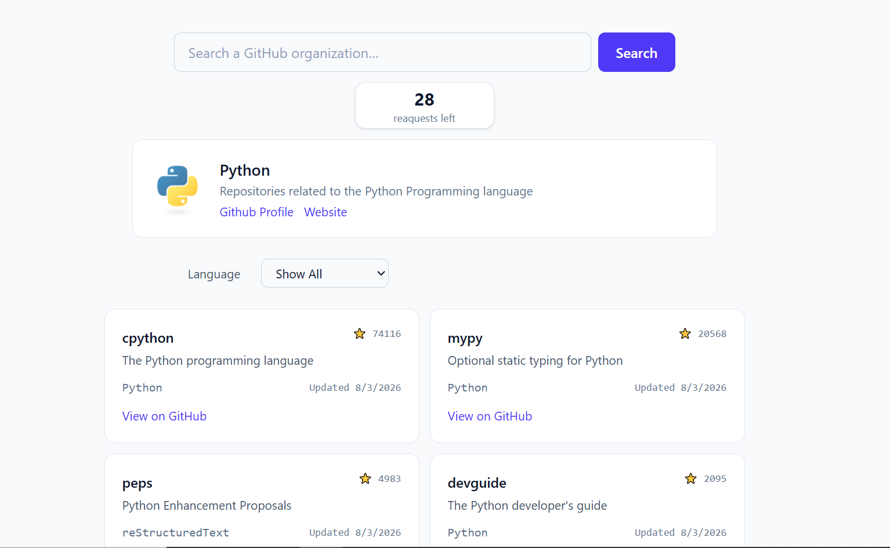

# Open Source Explorer

A companion tool for contributors preparing for Google Summer of Code (GSoC). Search any GitHub organization and get back a ranked, filterable list of its most actively maintained repositories — without manually browsing GitHub.

## Why this exists

The official GSoC site already lists participating organizations and project ideas. Once a contributor knows which organization they're interested in, the next step — figuring out _which of that org's repositories are actually worth exploring_ — usually means manually clicking through dozens of repos on GitHub, checking star counts and last-updated dates by hand. This tool automates that step: give it an org name, and it surfaces repositories that are both popular _and_ actively maintained, so a popular-but-abandoned project doesn't drown out a smaller one that's still getting real commits.

## Features

- Search any GitHub organization by its exact login (e.g. `python`, `kubernetes`)
- View the organization's avatar, name, description, GitHub profile link, and website
- A ranked list of repositories:
  - Archived repositories are excluded
  - Repositories not updated in over 2 years are excluded
  - Remaining repositories are scored on a blend of star count and recency, then sorted — so an old, hugely popular repo doesn't automatically outrank a smaller, actively maintained one
- Filter results by programming language, with options derived from the actual repositories returned (never an option that doesn't exist for that org)
- Each repository card shows name, description, primary language, star count, last-updated date, and a link to the repo on GitHub
- A visible "searches remaining" indicator, reflecting GitHub's unauthenticated rate limit in terms the user actually cares about (searches, not raw API requests)
- Specific, plain-language error messages for invalid/empty input, nonexistent organizations, rate limiting, and network failures — instead of a silent failure or generic error

## Live Demo

🔗 https://hu-maeruf.github.io/Open-Source-Explorer/

## Screenshot



## What it deliberately doesn't do

- No directory of GSoC organizations — the official GSoC site already does this well; this tool assumes you already know the org you're interested in
- No search by individual GitHub user or personal account — organizations only
- No judgment of a repository's beginner-friendliness (contributing guidelines, issue history) — that's better explored on GitHub directly, once a repo has caught your interest

## Tech Stack

- **React** (Vite)
- **Tailwind CSS**
- **GitHub REST API** (unauthenticated)

## API Used

[GitHub REST API](https://docs.github.com/en/rest) — specifically:

- `GET /orgs/{org}` — organization profile data
- `GET /orgs/{org}/repos?per_page=100` — organization's repositories
- `GET /rate_limit` — current API usage (this call itself doesn't count against the rate limit)

All requests are unauthenticated, which limits usage to **60 requests per hour** per IP address. Each search uses 2 requests (org + repos), so the app displays remaining **searches**, not raw requests — `⌊remaining_requests / 2⌋`, rounded down so the count never overpromises a search the user can't actually complete.

## Architecture

```
src/
├── api.js                    — talks to the GitHub API
├── ranking.js                — pure filtering/scoring/sorting logic, no React
├── App.jsx                   — orchestrates state, data flow, and rendering
└── components/
    ├── SearchBar.jsx
    ├── OrgProfile.jsx
    ├── RepositoryCard.jsx
    └── LanguageFilter.jsx
```

**`api.js`**
Fetches organization info, repository lists, and rate limit data from GitHub. Knows nothing about React or how data is displayed — it's a plain set of functions that could be called from any JS environment. Every failed HTTP response (non-2xx status) is turned into a thrown `Error` with a `.status` property and a status-specific message, so callers can distinguish _what kind_ of failure occurred without inspecting raw response objects.

**`ranking.js`**
A pure, React-free pipeline: filter out archived and stale (2+ year old) repos, score the rest on a weighted blend of `log(stars + 1)` and inverse days-since-update, then sort descending. Weights are a deliberate starting point, not a fixed formula — tuned by reasoning through concrete examples rather than solved analytically.

**`App.jsx`**
Holds all state (`loading`, `orgData`, `repos`, `error`, `selectedLanguage`, `rateLimit`), triggers fetches, and composes the ranking/filtering pipeline before handing data down to presentational components via props. This is also where all error-handling and messaging decisions are made.

**Components**
Each component is presentational — it receives data and callbacks via props and renders accordingly, with no knowledge of _how_ that data was obtained.

## Error Handling

- **Empty input** — the search input itself gates unnecessary requests
- **Organization not found (404)** — clear, specific message
- **Rate limit exceeded (403)** — clear, specific message
- **Network failure** (offline, request never reaches GitHub) — generic connectivity message, distinguished from GitHub-response errors by checking for the presence of a `.status` on the thrown error

## Future Improvements

- Results are capped at the first 100 repositories GitHub returns per organization (the API's per-request maximum); very large organizations aren't fully represented
- No pagination through results within the app itself
- The 2-year staleness cutoff and scoring weights are reasoned estimates, not tuned against real usage data
- No caching of recent searches, so repeating a search re-spends API quota

## What I Learned

- **React fundamentals from a vanilla JS background** — props as the mechanism for parent-to-child data flow, and callback props as the mechanism for child-to-parent communication — including the "lifting state up" pattern for state shared across sibling components
- **`useState` and controlled components** — and the specific pitfalls of updating object/array state
- **`useEffect`** — and why it exists specifically for side effects tied to a component's lifecycle (e.g., fetching once on mount), as distinct from effects that belong inside an existing event handler
- **`useMemo`** — memoizing an expensive derived value so it's only recalculated when its actual dependencies change
- **Async/await, `Promise.allSettled` vs. `Promise.all`** — and the real trade-off between fail-fast simplicity and independent per-request error handling
- **Designing a scoring/ranking algorithm from scratch** — including why raw values need normalization (`log()` to compress star counts) and weighting (to make differently-scaled factors comparably influential) before being combined
- **Separation of concerns** — structuring the app so `api.js` and `ranking.js` are fully independent of React, and components stay presentational, so each file changes for exactly one reason
- **Reading official API documentation directly** rather than relying on assumptions — confirming pagination limits and query parameters against GitHub's own docs
