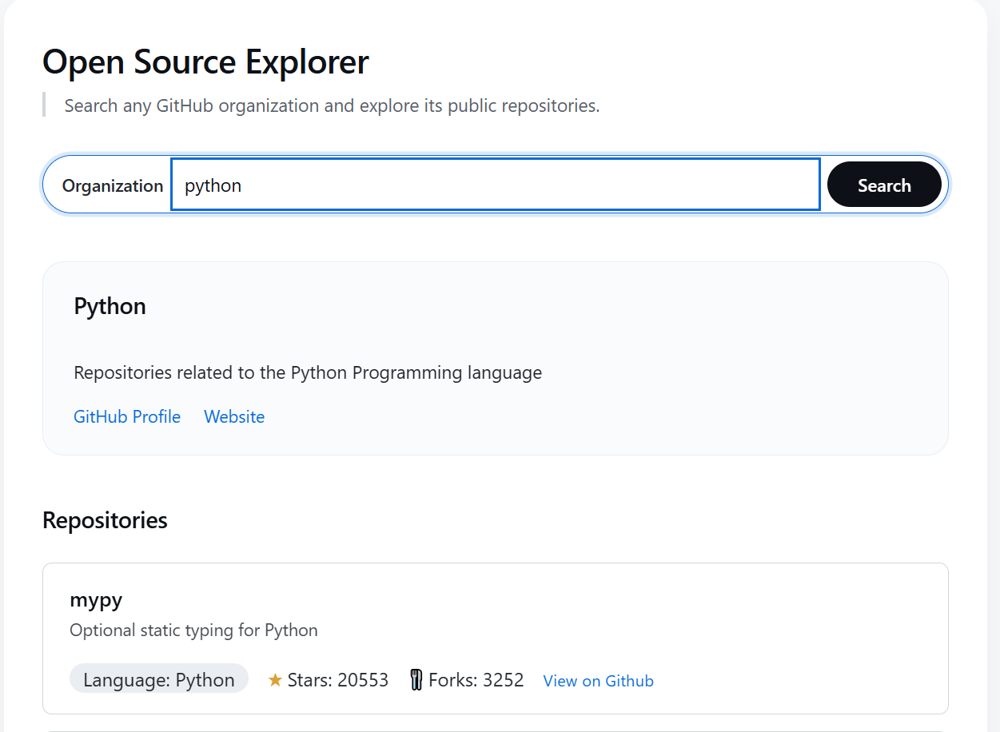

# Open Source Explorer

A small web app for discovering GitHub organizations and their most active repositories — built as prep work for finding organizations to contribute to for Google Summer of Code (GSoC).

## Why this exists

Before contributing to an open-source project, you first have to find one worth contributing to. Browsing GSoC organization lists one by one and manually checking each org's GitHub page is slow and repetitive. This tool takes an organization name and immediately surfaces the information that actually matters when evaluating whether to contribute: what the org does, and which of its repositories are active and popular enough to be worth a look.

## Features

- Search any GitHub organization by its exact login (e.g. `google`, `tensorflow`)
- View the organization's name, description, GitHub profile link, and website
- View its top 5 repositories, filtered and sorted by relevance:
  - Archived repositories are excluded
  - Remaining repositories are sorted by star count (descending)
- Each repository card shows name, description, primary language, stars, forks, and a link to the repo
- Graceful handling of invalid input, nonexistent organizations, GitHub API rate limits, and network failures

## Live Demo

🔗 https://hu-maeruf.github.io/Open-Source-Explorer/

## Screenshot



## Tech Stack

- **Vanilla JavaScript (ES6 modules)** — no frameworks, no bundler, no build step
- **HTML5 / CSS3**
- **GitHub REST API** (unauthenticated)

## API Used

[GitHub REST API](https://docs.github.com/en/rest) — specifically:

- `GET /orgs/{org}` — organization profile data
- `GET /orgs/{org}/repos` — organization's repositories

All requests are unauthenticated, which limits usage to **60 requests per hour** per IP address (2 requests per search, so ~30 searches/hour).

## Architecture

The codebase is split into three modules, each with a single responsibility:

```
js/
├── api.js   — talks to the GitHub API
├── ui.js    — renders data to the DOM
└── app.js   — orchestrates: wires events to api.js and ui.js
```

**`api.js`**
Fetches organization info and repository lists from GitHub. Knows nothing about the DOM or how data is displayed. Every failed HTTP response (any non-2xx status) is turned into a thrown `Error` object with a `.status` property attached, so callers can distinguish _what kind_ of failure occurred without inspecting raw response objects themselves.

**`ui.js`**
Takes data it's given and writes it into the page — rendering organization info, rendering repository cards, and showing/hiding error messages. It has no knowledge of `fetch`, the GitHub API, or when any of this should happen; it only knows how to display whatever it's handed.

**`app.js`**
Listens for the search form's `submit` event, validates input, calls `api.js` to fetch data, transforms it into the top 5 relevant repositories, and passes the result to `ui.js` to render. This is also where all error handling and user-facing messaging decisions are made.

This separation means each file only changes for one reason: `api.js` changes if the GitHub API changes, `ui.js` changes if the visual presentation changes, and `app.js` changes if the app's behavior or flow changes.

## Error Handling

- **Empty input** — validated before any network request is made, avoiding a wasted API call
- **Organization not found (404)** — shown as a clear, specific message
- **Rate limit exceeded (403)** — shown as a clear, specific message
- **Network failure** (offline, request never completes) — shown as a generic connectivity message, with the underlying error logged to the console for debugging
- Both API requests (org info and repositories) run concurrently via `Promise.all`, and any failure in either is caught by a single `try/catch` in the orchestration layer

## Future Improvements

- Only exact organization logins are supported — no fuzzy search or autocomplete
- Only GitHub **Organizations** are supported; accounts that are GitHub **Users** (some GSoC participants publish under a user account instead) currently return "not found"
- Repository relevance is based only on star count; it doesn't yet account for recent activity, open issue count, or `good-first-issue` labels
- No loading indicator is currently shown while a search is in progress
- Repository list is fixed at top 5 with no way to adjust the count

## What I Learned

- **Async/await and Promises** — including the distinction between a `fetch()` call's Response object and its parsed JSON body, and why each requires its own `await`
- **Concurrent requests with `Promise.all`** — and its fail-fast behavior, versus the alternative `Promise.allSettled`
- **`fetch()`'s error model** — it only rejects on network-level failure; HTTP error statuses like 404 or 403 must be checked explicitly via `response.ok`
- **Throwing and catching custom errors** — attaching contextual data (like `.status`) to thrown `Error` objects so calling code can react appropriately, and why a `catch` block should generally preserve or deliberately transform an error rather than silently discard it
- **ES6 modules in the browser** — native `import`/`export` without a bundler, including the requirement to include file extensions in import paths
- **Separation of concerns** — structuring a small app into distinct layers (API access, rendering, orchestration) so each file has one clear reason to change
- **Defensive handling of real-world API data** — accounting for missing or null fields (`description`, `language`, `blog`) rather than assuming a "clean" response shape
